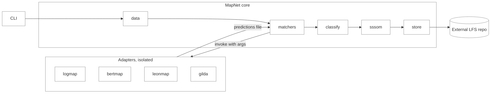
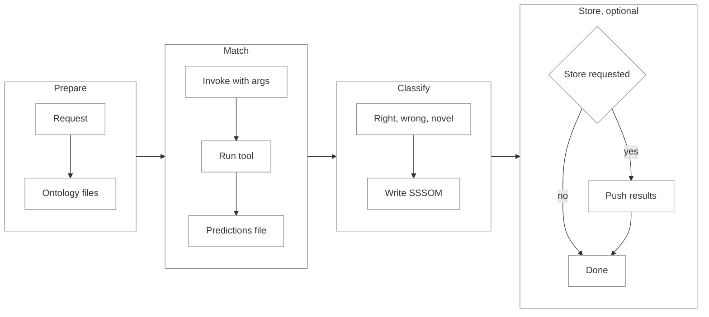

# MapNet

MapNet is an aggregator for biomedical ontology mapping tools. It runs one or more matchers (LogMap, BERTMap, LeonMap, Gilda, and others added later) over a pair of ontologies, classifies the resulting mappings against known evidence, and exports them in the biopragmatics SSSOM format.

Each matcher runs in its own isolated environment. MapNet supplies the input each tool asks for, collects the tool's output, and never mixes one tool's dependencies with another's. A single command takes a tool name, a source ontology, and a target ontology, and produces mapping files ready for downstream use.

## Contents

- [System architecture](#system-architecture)
- [Repository layout](#repository-layout)
- [Core modules](#core-modules)
- [Adapters](#adapters)
- [Run flow](#run-flow)
- [Output format](#output-format)
- [Command line interface](#command-line-interface)
- [Configuration](#configuration)
- [Packaging and execution](#packaging-and-execution)

## System architecture

MapNet has two halves. The core is a light orchestrator that always installs. The adapters are heavy, tool-specific units that each live in their own environment and are never imported by the core.



Nodes and edges:

- `CLI` is the single entry point. It reads a config or flags and calls the core.
- `MapNet core` is shown left to right in order of use: `data` fetches, `matchers` runs the tools, `classify` splits the results, `sssom` writes them, and `store` optionally keeps them.
- `matchers` is the only part that talks to an adapter. It invokes the adapter as a subprocess, passing the ontology files, threshold, and output path as arguments, and reads back the predictions file it writes, shown by the two labelled edges.
- `Adapters` are separate from the core, each in its own isolated environment.
- `store` pushes finished mapping sets to an external Git LFS repository when asked.

The rule that keeps this clean: core modules depend only on light, always-installable packages. Anything heavy (torch, faiss, jpype, deeponto, the leonmap package) exists only inside an adapter. An adapter's environment is `mapnet` plus that tool's own declared dependencies, resolved by uv or baked into a container. Installing `mapnet` there is cheap because its dependencies are light and the `Mapper` it imports pulls nothing heavy.

## Repository layout

```text
mapnet/
  configs/                 YAML study files: ontology versions, subset ids, threshold,
                           evidence set, and output paths
  mapnet/
    __init__.py            Package facade. The public API surface. Internal modules are
                           reached through here so internals can change without breaking callers.
    utils.py               Shared helpers used across every other module.
    data.py                Fetch and prepare ontology data for a tool.
    sssom.py               Read, write, and consolidate SSSOM files.
    classify.py            Reduce mappings to one to one, then split into right, wrong, novel.
    matchers.py            Tool registry and isolated run orchestration.
    store.py               Push results to the external mapping repository.
    cli.py                 Command line commands.
  adapters/
    manifest.toml          Authoritative registry: each tool's file, runtime, wanted format, deps.
    leonmap.py             Runs the LeonMap embedding matcher.
    gilda.py               Runs the Gilda lexical matcher.
    bertmap.py             Runs BERTMap through DeepOnto.
    logmap/                logmap.py plus Dockerfile. Runs the LogMap Java matcher in a container.
```

## Core modules

Every core module is defined below by what it consumes, what it produces, and what it holds.

### `__init__.py`

- Purpose: the package facade. Declares the public API and configures logging once.
- Consumes: nothing at import time beyond the standard library.
- Produces: the names other code imports from `mapnet`.
- Holds: the version string and the explicit export list.

### `utils.py`

- Purpose: the one shared module imported throughout the codebase. Small cross cutting helpers only.
- Consumes: a CURIE, a prefix, a config path, or a configured location depending on the helper.
- Produces: canonical CURIEs, the SSSOM column schema, identifier to label maps, cross reference maps, loaded config objects, and resolved paths.
- Holds: the column definitions, prefix normalisation rules, the config loader, and `resolve_path`, which resolves the data, output, and runs locations against a base that defaults to `./` and accepts relative or absolute paths. No tool specific logic lives here.

### `data.py`

- Purpose: get the ontology data and convert it to the format a tool asks for. Supplies the file and then steps aside, because mature tools handle their own internal formatting.
- Consumes: an ontology prefix, an optional version, an optional redownload flag, and the format an adapter declared it wants (for example `obo` or `owl`).
- Produces: an ontology file in the requested format, plus its source version, read from the file itself when the file carries one.
- Holds: a thin `get_ontology(prefix, version=None, redownload=False)` wrapper over pyobo and bioregistry, plus the ROBOT calls for format conversion and subsetting. Version defaults to latest when not given. Caching is delegated to pyobo, so MapNet keeps no versioned store of its own; an existing file is verified rather than refetched unless redownload is set.

### `sssom.py`

- Purpose: all reading and writing of the SSSOM format, plus consolidation of several tools' outputs.
- Consumes: a mapping table and prefixes, or several existing SSSOM files from a multi tool run.
- Produces: a valid SSSOM file with an inferred curie map header; and, when consolidating, one merged SSSOM plus a separate run provenance file.
- Holds: the curie map inference from bioregistry, the header writer, and the consolidator. The consolidator takes the union of the tools' mappings, deduplicated on subject and object, keeping the row from the earliest tool in execution order when a pair repeats. The merged file stays standard SSSOM with `mapping_tool` set to that winning tool and no extra columns. Alongside it, a provenance file records subject, object, and the tools that produced each mapping; the per tool and overlap counts, the Venn breakdown, are group counts derived from this file. It joins back to the merged SSSOM on subject and object at runtime.

### `classify.py`

- Purpose: turn raw predictions into the right, wrong, and novel sets that make results usable.
- Consumes: a predictions table and a chosen set of evidence sources.
- Produces: three tables named right, wrong, and novel, where novel is the set of new mappings with no existing evidence.
- Holds: the one to one reduction with a confidence tie break, the evidence providers registered in a dictionary (biomappings, obo cross references, semra), and the right, wrong, novel split. Evidence is exactly what the run names, with no auto selection; a landscape source like semra is named with its landscape, for example `semra:disease`.

### `matchers.py`

- Purpose: know which tools exist and run the selected ones in isolation.
- Consumes: a tool name, the prepared input files, and run options such as threshold.
- Produces: for each selected tool, its `predictions.sssom.tsv` written to the run's working folder.
- Holds: the tool registry read from the central manifest, the uv and container runners, and the invocation. It calls each adapter as a subprocess with the ontology files, threshold, and output path as arguments. Tools run one at a time by default; a parallel flag launches them together. Success is a zero exit code confirmed by a readable SSSOM at the output path; a non-zero exit, or a missing or unparseable output, is a failure, and the adapter's captured stderr is surfaced. A tool that fails is reported at once and the others keep going; when it is the only tool, the command itself exits non-zero.

### `store.py`

- Purpose: push finished mapping sets to the external Git LFS repository with author attribution.
- Consumes: one or more mapping sets, the chosen buckets to store, and the caller's identity.
- Produces: a commit in the external repository, titled with the author name and ORCID, or a local write when push rights are absent.
- Holds: the clone and commit logic, the attribution rules, and the run provenance written next to each stored file.

### `cli.py`

- Purpose: the command line surface.
- Consumes: command line arguments or a config file path.
- Produces: the effects of the chosen command by calling the modules above.
- Holds: the argument definitions for the map, classify, and aggregate commands, and the `--store-results` flag.

## Adapters

Each matcher is wrapped by an adapter that is part of the mapnet project but lives outside the importable `mapnet` package, so its heavy dependencies can never reach the core. A Python tool's adapter is a single plain script, for example `leonmap.py`; a tool that needs a container, such as LogMap, adds a `Dockerfile` alongside its script. The script imports `mapnet` only for the light `Mapper` base class. Every adapter is invoked the same way: core runs it as a subprocess, under uv or a container, passing the ontology files, the output path, and options such as the threshold as arguments; the adapter writes an SSSOM file at the output path and exits, and core treats a zero exit with a readable output as success.

### Manifest

One central `adapters/manifest.toml` is the authoritative registry. It lists every tool with its file, runtime, the format it wants, and its dependencies. The core reads this file to know which tools exist and how to run each, with no heavy import.

```toml
[leonmap]
entry = "leonmap.py"
runtime = "uv"                                   # or "container"
wants_format = "owl"                             # the format data.py must deliver
deps = ["mapnet", "faiss-cpu", "rdflib", "leonmap"]

[gilda]
entry = "gilda.py"
runtime = "uv"
wants_format = "obo"
deps = ["mapnet", "gilda", "indra"]

[logmap]
entry = "logmap.py"
runtime = "container"
wants_format = "obo"
dockerfile = "logmap/Dockerfile"
container_runtime = "docker"                      # or apptainer on HPC
```

Because the dependencies live in the manifest, each tool file stays a plain script with no packaging boilerplate. For a uv tool the core runs `uv run --with <deps> adapters/<entry> --source <src> --target <tgt> --threshold <t> --out <predictions>`. For a container tool the core builds or pulls the image named by `dockerfile` and runs it with `docker` or `apptainer`, passing the same arguments, so the same tool runs on a laptop or on an HPC cluster. Adding a tool means dropping in one script and adding one manifest entry.

### The mapper base class

The `Mapper` base class lives in `mapnet` and is deliberately light, so importing it pulls no heavy core dependency. Every adapter imports it and returns its rows through it. This is the single shared contract that guarantees conformant SSSOM output. An adapter subclasses it once, with no deeper hierarchy. Tools that emit extra context, such as LeonMap's predicate reasoning, do so inside their own subclass.

```python
from mapnet import Mapper

class LeonMapMapper(Mapper):
    name = "leonmap"
    version = "1.2.0"     # the matcher version, recorded on every row
    tool_id = ""          # optional wikidata or URL identifier
```

The adapter fills the mapping columns and the tool identity columns. The core fills the source versions, the date, and the curie map header, because only the core knows those.

## Run flow

A single match request moves through the core, out to an isolated adapter, and back.



Nodes and edges:

- `Prepare`: the CLI request is turned into source and target ontology files by `data`.
- `Match`: the core invokes the adapter as a subprocess with the ontology files and options as arguments, the adapter runs in isolation, and it writes a predictions file back.
- `Classify`: the core splits the predictions into right, wrong, and novel, then writes each set as SSSOM.
- `Store, optional`: if requested, the chosen sets are pushed to the external repository, otherwise the run ends with the files on disk.

When several tools are selected, the core runs them one at a time by default, or together under `--parallel`, each in its own working folder, collecting each tool's predictions as it finishes.

## Output format

MapNet writes the biopragmatics SSSOM columns:

```text
subject_id  subject_label  predicate_id  object_id  object_label
mapping_justification  subject_source_version  object_source_version
mapping_tool  mapping_tool_id  mapping_tool_version  mapping_date  confidence
```

Field ownership:

| Column | Filled by |
| --- | --- |
| subject_id, subject_label, object_id, object_label | adapter |
| predicate_id | adapter |
| mapping_justification | adapter |
| confidence | adapter |
| mapping_tool | adapter |
| mapping_tool_version | adapter |
| mapping_tool_id | adapter |
| subject_source_version, object_source_version | core |
| mapping_date | core |
| curie map header | core |

The curie map header is built from the prefixes actually used, resolved through bioregistry. A prefix that bioregistry cannot resolve is the only case that needs a URL supplied in config.

## Command line interface

One tool name, one source, one target, and mappings happen directly.

```text
mapnet map --tool leonmap --source mondo --target mesh
mapnet map --tool leonmap --source mondo --target mesh --raw
mapnet map --config configs/mondo_mesh.yaml
mapnet classify predictions.sssom.tsv --evidence biomappings,obo-xref,semra:disease
mapnet aggregate novel_a.sssom.tsv novel_b.sssom.tsv novel_c.sssom.tsv
mapnet map --config configs/mondo_mesh.yaml --parallel
mapnet map --tool leonmap --source mondo --target mesh --store-results novel
```

- `map` runs the full pipeline: fetch data, run the tool, classify, and write the right, wrong, and novel sets. `--raw` stops after predictions.
- `classify` runs classification on an existing predictions file against a chosen evidence set.
- `aggregate` consolidates several tools' sets into one merged SSSOM plus a run provenance file, with the earliest tool in execution order winning a repeated pair.
- `--parallel` runs the selected tools together instead of one at a time.
- `--store-results` accepts `all`, `novel`, `right`, or `wrong`, and pushes those sets to the external repository. It is off by default.

## Configuration

A study config file holds the values that would otherwise be repeated on the command line, so a whole mapping study is described in one place.

```yaml
source:
  prefix: mondo
  version: 2025-03-04     # optional, omit for latest
target:
  prefix: mesh            # version omitted, latest is used
tools:                    # more than one tool runs each in turn
  - leonmap
  - gilda
threshold: 0.9            # default confidence threshold, a tool may override its own
evidence:                 # exactly the sources used, no auto-selection
  - biomappings
  - obo-xref
  - semra:disease         # name the landscape explicitly
redownload: false         # force a fresh ontology pull
prefix_aliases:           # map a tool's CURIE prefixes to what MapNet expects
  icd-10: icd10
  icd-10-cm: icd10cm
paths:                    # resolved by resolve_path, default ./
  data: ./data
  output: ./output
  runs: ./runs
```

Anything not given on the command line is read from the config. When more than one tool is listed, each runs and writes its own right, wrong, and novel sets under the output path, one directory per tool; combining them is the separate `aggregate` step. A tool that fails is reported at once and does not stop the others. Ontology versions are optional and default to latest. The `prefix_aliases` block maps a tool's CURIE prefixes onto the canonical prefixes MapNet expects, applied when predictions and evidence enter the core, so adapters stay responsible for their own output and the known variants are handled in one declared place. The `paths` block sets where data, outputs, and run directories live, resolved by `resolve_path` against a base that defaults to the current directory.

## Packaging and execution

MapNet follows a uv based workflow at every step.

- The core is a uv project with light dependencies only.
- Each adapter is a uv project or a container. Its environment is resolved on first use and cached, so later runs are fast.
- MapNet ships as a Docker image that contains the core, with uv running inside for the Python adapters.
- A Docker free install is supported for local and HPC use. On HPC, LogMap runs through Apptainer rather than Docker, selected by the adapter manifest.

The result is a standalone mapper. It fetches what it needs, runs each tool in a clean environment, and writes mappings in a format that other biopragmatics tools already understand.
