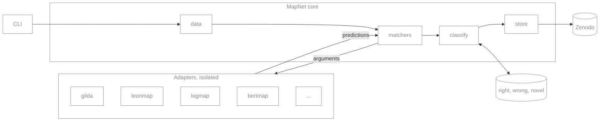
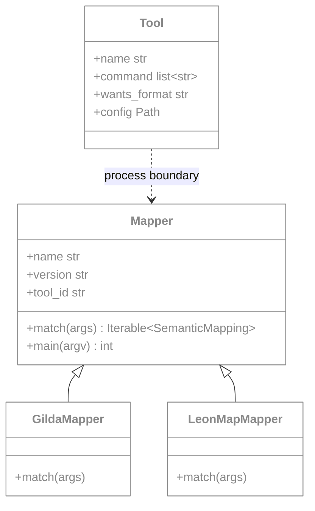
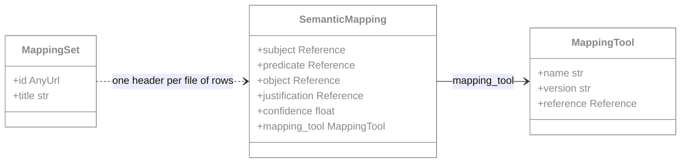
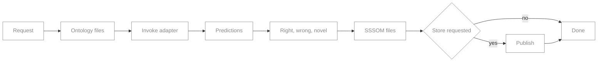
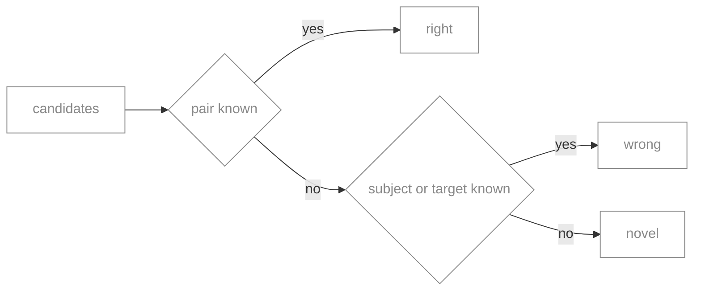
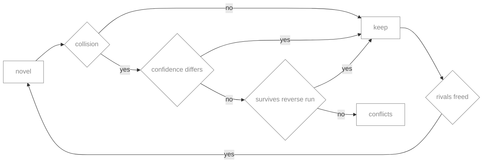

# Design

## Architecture

The core is a light orchestrator that always installs. Adapters are heavy, tool specific units
that each live in their own environment and are never imported by the core.

`matchers` is the only module that talks to an adapter. It appends the standard arguments to the
tool's command, spawns it, and reads back the SSSOM file it wrote.

## Rules

1. MapNet runs a command. It never resolves a package. Dependencies belong to the adapter,
   declared in its PEP 723 header and resolved by uv.
2. Base dependencies stay light. Installing `mapnet` beside a tool does not conflict with it.
3. Tools are read only. The adapter translates. MapNet never patches a tool.
4. An adapter emits every candidate it finds. Reduction happens in `classify`.

## Classes

The classes MapNet defines are `Tool` and `Mapper`. Adapters subclass `Mapper`.

`Tool` is a frozen dataclass, one per manifest entry, and `matchers.run` spawns it. The dashed
edge is the process boundary: no core module imports an adapter. `Mapper` is a base class, not a
plugin registry.

The output model comes from `sssom_pydantic`.

Only the fields MapNet sets are shown. `MappingSet` is the file header and does not hold the
rows.

## Run flow

One run takes one tool. Several tools per run is planned. `map --classify` carries a run
through the split in one command; publishing is gated the same way once `store` exists.

## Classification

Planned. Every candidate is split against evidence first.

| Pair known | Subject known | Target known | Bucket |
| --- | --- | --- | --- |
| yes | any | any | right |
| no | yes | any | wrong |
| no | no | yes | wrong |
| no | no | no | novel |

Reduction then runs inside `novel`, where evidence has nothing to say.

- A collision is a subject or object claimed by more than one candidate in the same run.
- Only `novel` is reduced. `right` is already curated and `wrong` records a contradiction, so
  neither collapses.
- Confidence separates a collision first, then the reverse run.
- The reverse run calls the same adapter with source and target swapped. A pair kept in both
  directions survives.
- Reduction repeats until a pass settles nothing. A candidate that wins its subject and then
  loses its object frees the rival it had beaten, which is reconsidered rather than lost with it.
- A collision that reaches the end unseparated goes to `conflicts`, not to a bucket.
- Reduction applies to `skos:exactMatch` only. `narrowMatch` and `broadMatch` are many to one.
- Confidence is comparable within one tool's output, not across tools. A cross tool tie that
  evidence cannot separate falls to tool precedence.
- Evidence is undirected. A mondo to mesh prediction is checked against mesh to mondo rows.
- A wrong row carries the mapping it conflicts with.
- The resolved evidence version is stamped on the output set.

`SOURCES` registers every evidence set as a kind and a location. `EVIDENCE` lists the ones
consulted, overridable per run on `--evidence`. A location resolves to a file: `obo` to the
ontologies the run is mapping, a Zenodo concept to a cached record, a URL as given. A
`rejected` kind rules a pair out outright, a `predicted` kind carries no curation and so can
only rescue a candidate no curated source has ruled on. A name on `--evidence` may carry its
kind, as `rejected:mine.sssom.tsv`, which is the only way a local file becomes anything other
than asserted.

Rescuing a candidate out of `novel` also removes it from the collision groups, so which
evidence is enabled decides not only how candidates are labelled but which of the survivors
reduction keeps. Each source reports how many pairs it contributed, and one contributing none
says so on stderr.

## Fetching

`fetch` is the only thing that downloads, and it covers ontologies and evidence alike, so
everything a run reads sits under `data/`. Classification never reaches the network: a Zenodo
concept resolves to the newest record already cached, and the concept is re-resolved only when
a refetch is asked for.

Nothing refreshes on a timer. `REFRESH` names the sources that change upstream and a bare
`mapnet fetch` refetches exactly those; everything else stays pinned to what is on disk.
`data/downloads.json` records each file's URL, sha256, size and date, which is what lets a
refresh report whether upstream actually changed and what a UI reads to offer the same.

## Modules

| Module | Responsibility |
| --- | --- |
| `__init__.py` | Package facade. Declares the public API and attaches a null log handler. |
| `manifest.py` | The central registry: URLs, evidence sets, what refreshes, and registered tools. |
| `utils.py` | Cross cutting helpers: CURIE normalisation, ontology prefixes, run log paths. |
| `data.py` | Resolve, download and cache ontologies and evidence under `data/`, recording every file fetched. |
| `sssom.py` | Read and write SSSOM, infer the curie map, stamp tool identity, write atomically. |
| `mapper.py` | The `Mapper` base class and the argument parser every adapter shares. |
| `matchers.py` | Read the manifest, spawn a tool as a subprocess, capture its log. Per run options pass straight through as flags. |
| `classify.py` | Combine several tools' predictions, reduce, then split into right, wrong and novel. |
| `store.py` | Publish mapping sets to the Zenodo deposition in the manifest. Planned. |
| `cli.py` | Command line surface. Registers every subcommand, then reports what the core returns. |
