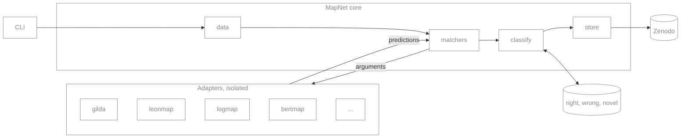
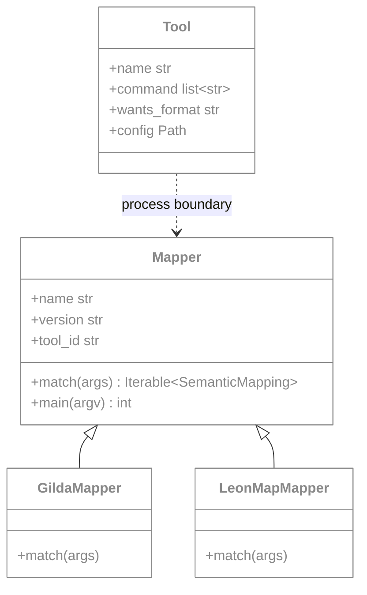
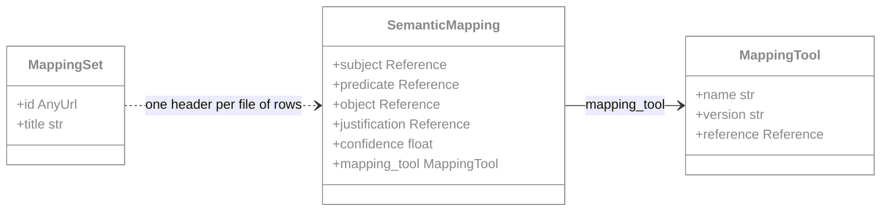
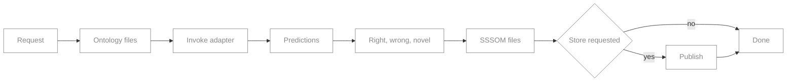
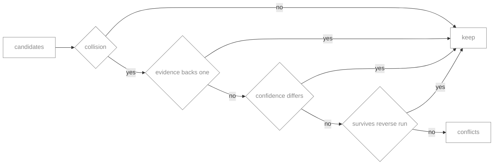
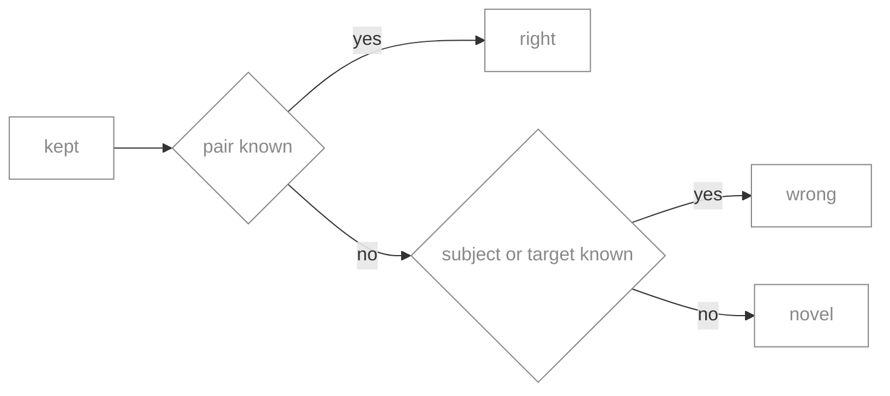

# Design

## Architecture

The core is a light orchestrator that always installs. Adapters are heavy, tool specific units
that each live in their own environment and are never imported by the core.

`matchers` is the only module that talks to an adapter. It appends the standard arguments to the
tool's command, spawns it, and reads back the SSSOM file it wrote.

## Rules

1. MapNet runs a command. It never resolves a package. Dependencies belong to the adapter,
   declared in its PEP 723 header and resolved by uv.
2. Base dependencies stay light. Installing `mapnet` beside a tool does not conflict with it.
3. Tools are read only. The adapter translates. MapNet never patches a tool.
4. An adapter emits every candidate it finds. Reduction happens in `classify`.

## Classes

The classes MapNet defines are `Tool` and `Mapper`. Adapters subclass `Mapper`.

`Tool` is a frozen dataclass, one per manifest entry, and `matchers.run` spawns it. The dashed
edge is the process boundary: no core module imports an adapter. `Mapper` is a base class, not a
plugin registry.

The output model comes from `sssom_pydantic`.

Only the fields MapNet sets are shown. `MappingSet` is the file header and does not hold the
rows.

## Run flow

One run takes one tool. Several tools per run is planned.

## Classification

Planned. Reduction runs before the split. It resolves collisions in a fixed order and stops at
the first step that separates the candidates.

Each survivor is then split against evidence.

| Pair known | Subject known | Target known | Bucket |
| --- | --- | --- | --- |
| yes | any | any | right |
| no | yes | any | wrong |
| no | no | yes | wrong |
| no | no | no | novel |

- A collision is a subject or object claimed by more than one candidate in the same run.
- Evidence is tried before confidence. Evidence is curated, confidence is tool relative.
- The reverse run calls the same adapter with source and target swapped. A pair kept in both
  directions survives.
- A collision that reaches the end unseparated goes to `conflicts`, not to a bucket.
- Reduction applies to `skos:exactMatch` only. `narrowMatch` and `broadMatch` are many to one.
- Confidence is comparable within one tool's output, not across tools. A cross tool tie that
  evidence cannot separate falls to tool precedence.
- Evidence is undirected. A mondo to mesh prediction is checked against mesh to mondo rows.
- A wrong row carries the mapping it conflicts with.
- The resolved evidence version is stamped on the output set.

Evidence sources are named per run, with no auto selection: `biomappings`, `obo-xref`, and a
landscape such as `semra:disease`. Each resolves the same three ways as an ontology: a URL is
used as given, a pinned version is fetched by record or ref, otherwise the latest is resolved
and recorded.

## Modules

| Module | Responsibility |
| --- | --- |
| `__init__.py` | Package facade. Declares the public API and attaches a null log handler. |
| `utils.py` | Cross cutting helpers: CURIE normalisation, ontology prefixes, run log paths. |
| `data.py` | Resolve, download and cache ontology files in the format an adapter asks for. |
| `sssom.py` | Read and write SSSOM, infer the curie map, stamp tool identity, write atomically. |
| `mapper.py` | The `Mapper` base class and the argument parser every adapter shares. |
| `matchers.py` | Read the manifest, spawn a tool as a subprocess, capture its log. |
| `classify.py` | Reduce to one to one, then split into right, wrong and novel. Planned. |
| `store.py` | Publish mapping sets to Zenodo. Planned. |
| `cli.py` | Command line surface. One registration function per subcommand. |
